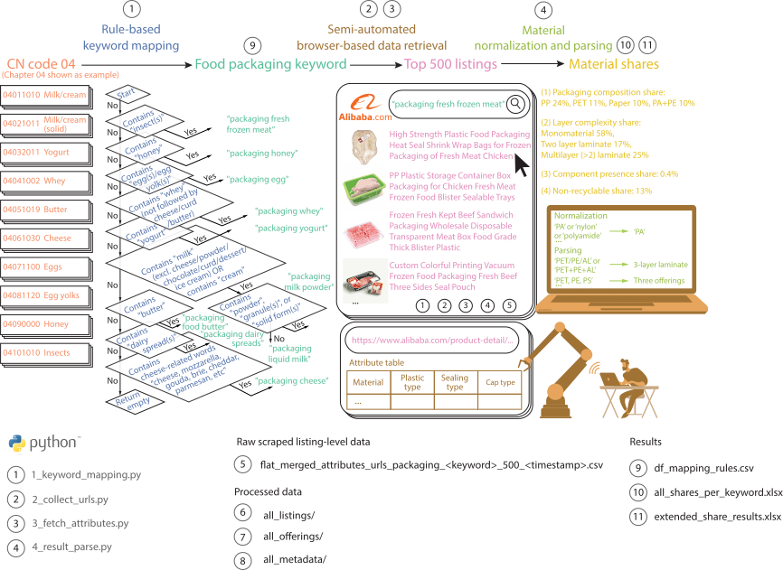

[](https://doi.org/10.5281/zenodo.17930765)
# Overview
This repository contains the data and code underlying the study:
**“Functional lock-in sustains nearly half of food-packaging designs multimaterial in global B2B supply chains.”**





The repository provides **design-level evidence** on material composition, laminate structures, component compatibility, and recycling incompatibility in food packaging. The data are derived from large-scale scraping and structured parsing of global business-to-business (B2B) packaging listings on Alibaba.com and are linked to food product categories defined under the EU Combined Nomenclature (CN).

The materials support:

- reproducibility of the results reported in the paper,
- reuse in material flow analysis (MFA),
- systematic assessment of Design-for-Recycling (DfR) alignment,
- further research on structural lock-in in packaging systems.

# Data scope

**Food product coverage**  
2,397 EU Combined Nomenclature (CN) food codes  
(Chapters 02–23; excluding non-food Chapters 05, 06, 13, and 14)

**Packaging design data**  
41,000 packaging listings scraped from Alibaba.com  
(up to 500 listings per packaging keyword; 82 keywords)

**Supply-chain context**  
Global B2B marketplace listings from Original Equipment Manufacturers (OEM) and Original Design Manufacturers (ODM)

# Repository structure
```
food_packaging_design_data.zip
├── code/
│ ├── 1_keyword_mapping.py
│ ├── 2_collect_urls.py
│ ├── 3_fetch_attributes.py
│ └── 4_result_parse.py
│
├── data_raw/
│ ├── flat_merged_attributes_urls_packaging_<keyword>500<timestamp>.csv
│ └── (82 files; one per packaging keyword)
│
├── data_processed/
│ ├── all_listings/
│ │ └── listings_<keyword>.csv (82 files)
│ ├── all_offerings/
│ │ └── offerings_<keyword>.csv (82 files)
│ └── all_metadata/
│ └── metadata_<keyword>.csv (82 files)
│
└── readouts/
├── df_mapping_rules.csv
├── all_shares_per_keyword.xlsx
└── extended_share_results.xlsx
```
## 1. `code/` — analysis pipeline

Python scripts implementing the full workflow:

- **`1_keyword_mapping.py`**  
  Maps CN food product codes to packaging-relevant search keywords using a transparent, rule-based system.

- **`2_collect_urls.py`**  
  Retrieves Alibaba listing URLs for each packaging keyword.

- **`3_fetch_attributes.py`**  
  Scrapes structured attribute tables from each listing.

- **`4_result_parse.py`**  
  Normalizes material information, reconstructs laminate structures and components, computes offering- and sales-weighted share indicators, and generates final readouts.

Scripts are designed to be executed sequentially.

## 2. `data_raw/` — raw scraped listing-level data

Contains 82 CSV files of the form:
Each file corresponds to one packaging keyword and contains up to 500 Alibaba listings.

### Column groups include:

- **Script-defined control and traceability fields**  
  (`count`, `page`, `url`, `title`, `highlighted_tokens`, `highlight_count`,  
  `url_collecting_time`, `attribute_fetch_time`, `sold`)

- **Raw Alibaba attribute fields**  
  Material descriptions, packaging form descriptors, component information, and commercial metadata as provided by sellers.

These files preserve the original scraped evidence and support transparency and reprocessing.


## 3. `data_processed/` — harmonized analytical datasets

### a) `all_listings/`

Cleaned, listing-level datasets with harmonized material fields.

Key columns include:

- `material_parsed`, `options_str`
- `layer_counts`, `is_laminate`
- `has_component`, `component_materials`
- `component_match_body`
- `w_offering`, `w_sales`

### b) `all_offerings/`

Expanded offering-level datasets, where each listing may generate multiple offerings reflecting alternative material configurations.

Additional analytical fields include:

- `layer_class`
- `NR_sub_share_type`
- `nr_flag`

These data form the analytical basis for all reported material-share indicators.

### c) `all_metadata/`

Per-keyword metadata reporting:

- number of listings,
- number of offerings,
- parsed-offering counts,
- sales-data availability and coverage.

## 4. `readouts/` — final analytical outputs

### a) `df_mapping_rules.csv`

Rule-based mapping table linking CN food codes to packaging keywords using regular expressions.  
This file documents the semantic and functional logic used to translate trade classifications into packaging search categories.

### b) `all_shares_per_keyword.xlsx`

Offering-weighted share results for each of the 82 packaging keywords, including:

- packaging-composition share,
- layer-complexity share,
- component-presence share,
- recycling-incompatibility share.

Each sheet corresponds to one packaging keyword.

### c) `extended_share_results.xlsx`

Cross-packaging aggregated results structured by:

- share type (composition, layers, components, incompatibility),
- weighting scheme (offering-weighted, sales-weighted).

This file underlies the figures and tables reported in the paper and Supplementary Information.

# Relation to the paper

- **Supplementary Dataset (journal)**  
  Contains the main aggregated results (`df_mapping_rules.csv`, `all_shares_per_keyword.xlsx`, and `extended_share_results.xlsx`) used for interpretation.

- **This Zenodo repository**  
  Provides the full underlying data, intermediate datasets, and code required to reproduce or extend the analysis.

# Intended reuse

The dataset is suitable for:

- material flow analysis (MFA),
- Design-for-Recycling (DfR) evaluation,
- packaging policy analysis,
- comparative studies of global packaging design practices.

# Citation

Please cite the associated article when using this dataset.  
A Zenodo DOI is provided for direct citation of this repository.
